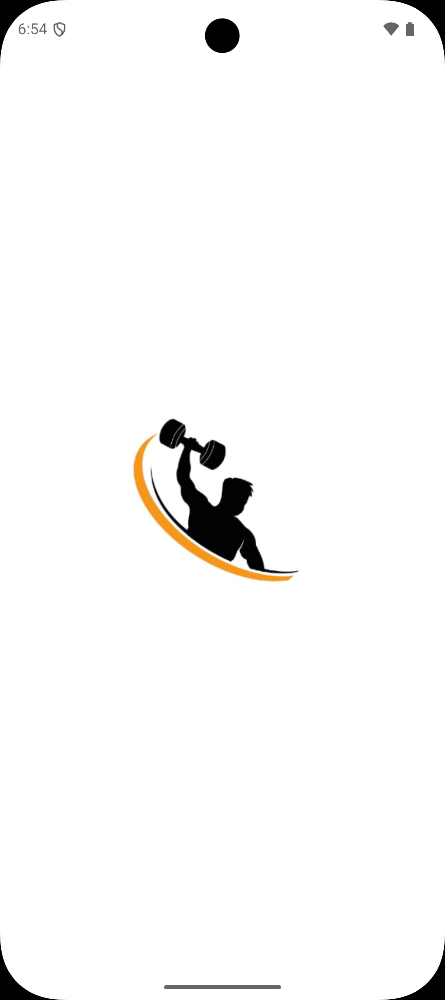
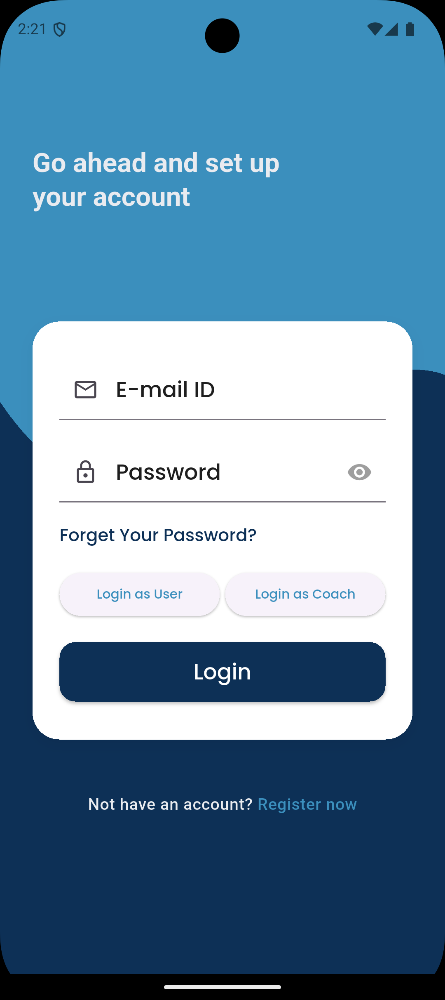
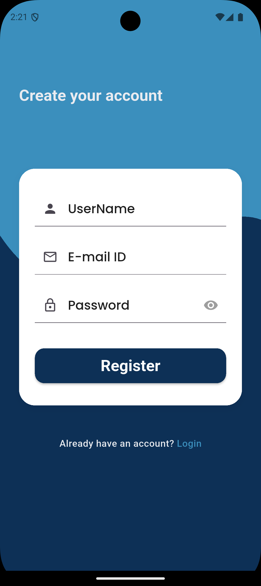
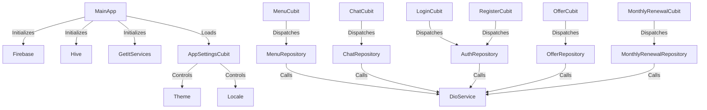
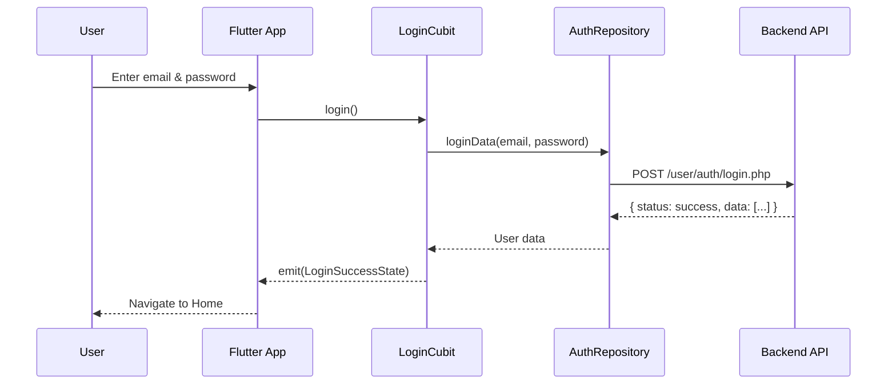

# Flutter Fitness App Documentation

This documentation provides a comprehensive overview of the main features, architecture, and components of the Flutter Fitness App. It covers Firebase integration, authentication, chat, notifications, menu/cart management, themes, localization, and more. Each file is detailed below, explaining its purpose, key logic, and relationships.

---


  <div style="display: flex; flex-wrap: wrap; gap: 10px;">
  
  
  

</div>


## `firebase_options.dart`

This file contains the platform-specific Firebase configuration for initializing the app with Firebase services. It uses the `FirebaseOptions` class to specify credentials for different platforms (web, Android, iOS, macOS, Windows).

```dart
await Firebase.initializeApp(
  options: DefaultFirebaseOptions.currentPlatform,
);
```

**Purpose:**
- Provides Firebase settings for all supported platforms.
- Ensures correct credentials are used depending on the platform.
- Used at app startup for `Firebase.initializeApp`.

---

## `main.dart`

The entry point of the application. It handles initialization for Firebase, Hive (local storage), dependency injection, notifications, and theme settings.

**Key Features:**
- Sets up Firebase and notification services.
- Initializes Hive for local data caching.
- Sets up dependency injection via `GetItServices`.
- Configures theme and localization using the `AppSettingsCubit`.
- Handles Stripe payment setup.

```dart
void main() async {
  WidgetsFlutterBinding.ensureInitialized();
  NotificationService().init();
  await Firebase.initializeApp(options: DefaultFirebaseOptions.currentPlatform);
  GetItServices.setup();
  await Future.wait([
    UserApp.userIsAuthorized(),
    CoachApp.coachIsAuthorized(),
    DioService.init(),
  ]);
  FirebaseMessaging.onBackgroundMessage(_firebaseMessagingBackgroundHandler);
  myBox = await initBoxHive("fares");
  if (!myBox!.containsKey("isDark")) {
    myBox!.put("isDark", false);
  }
  StripeSetup.setup(
    publishableKey: String.fromEnvironment('STRIPE_SECRET_KEY'),
  );
  runApp(const MyApp());
}
```

---

## `clip_path.dart`

Defines a custom clipper for drawing a curved background in UI sections (used in login, onboarding, etc.).

**Key Points:**
- Uses Bézier curves for a smooth wave at the bottom.
- Enhances visual appeal.

---

## `colors.dart`

Centralizes the color palette used across the app. This helps maintain design consistency.

**Example Colors:**
- `primary, grey, black, orange, green` etc.

---

## `fcmc.config.dart`

Handles Firebase Cloud Messaging (FCM) configuration for push notifications.

**Features:**
- Requests notification permissions.
- Sets up listeners for message events.
- Triggers chat data refresh when messages are relevant to the current page.

---

## `fileupload.dart`

Provides functions and UI for file/image picking and upload interaction (gallery, camera, remove).

**Features:**
- Shows a modal for choosing attachment options.
- Handles image and video picking.
- Simulates file upload for chat or other uses.

---

## `images_asset.dart`

Centralizes asset image paths as constants, making it easy to reference workout GIFs, icons, etc., throughout the app.

---

## `routes.dart`

Defines string constants for all the app's named routes.

---

## `localization.dart`

Implements a basic localization system using JSON translations. Integrates with Flutter's localization features.

**Process:**
1. Loads the relevant language JSON.
2. Provides a `translate` method for key lookups.

---

## `theme.dart`

Defines three theme variants:
- `themeEnglish` for English UI.
- `themeArabic` for Arabic UI.
- `themeDark` for dark mode.

Each theme customizes colors, fonts, and text styles.

---

## `login_cubit.dart` and `login_state.dart`

Implements the BLoC (Cubit) for the login process.

**Features:**
- Manages form state and visibility of password.
- Handles login for both users and coaches.
- Saves user/coach data to secure storage and Hive.
- Manages FCM topic subscriptions.

**State Classes:**
- `LoginInitial`, `LoginLoadingState`, `LoginSuccessState`, `LoginFailedState`.

---

## `register_cubit.dart` and `register_state.dart`

Handles user registration logic.

**Features:**
- Manages form state and password visibility.
- Calls the repository to register.
- Emits loading, success, or failure states.

---

## `chat_cubit.dart` and `chat_state.dart`

Provides chat logic: loading messages, sending messages (with/without files), and managing chat subscriptions.

**Features:**
- Uses streams for live chat updates.
- Manages message lists and chat cards.
- Refreshes chat data on certain triggers.

---

## `coache_cubit.dart` and `coache_state.dart`

Handles the business logic for listing coaches.

**Features:**
- Loads all coaches from the repository.
- Emits loading, loaded, or failure states.

---

## `menus_state.dart` and `menu_cubit.dart`

Manage the food menu and cart.

**Features:**
- Loads menu data and cart data.
- Handles adding/removing items to/from cart.
- Keeps track of total price and calories.

---

## `monthly_renewal_cubit.dart` and `monthly_renewal_state.dart`

Handles viewing of monthly payment/renewal history.

**Features:**
- Loads renewal records per user.
- Groups payment history by year for display.

---

## `dio.dart`

Encapsulates HTTP logic using the Dio package. Implements generic GET, POST, PUT, PATCH, DELETE, file upload, and download methods.

**Example:**
```dart
static Future<Response> postData({ ... })
```

---

## `failure.dart`

Defines custom failure types for error handling, used in repositories.

---

## `offer_cubit.dart` and `offer_state.dart`

Handles the business logic for loading app offers (promotions, etc.).

---

## `theme_cubit.dart` and `theme_state.dart`

Manages app-wide theme and localization state.

**Features:**
- Initializes language and dark mode based on saved values.
- Allows toggling of theme and language.

---

## `user_app.dart`

Stores static methods to determine whether a user or coach is authorized (logged in).

---

## `api_end_point.dart`

Centralizes all API endpoint URLs as string constants.

---

## `show_shimmer_loading.dart`

Provides a shimmer effect widget, used as a placeholder when loading data.

---

## `cartmodel.dart`

Defines the data model for cart items, including fields for price, calories, quantity, etc.

---

## `show_toast_notification.dart`

Shows success or error toast notifications using a third-party package.

---

## `chat_model.dart`, `card_chat_model.dart`

Define the data models for chat messages and chat list cards.

---

## `valid_input.dart`

Provides utility functions for validating user input (email, phone, password, etc.).

---

## `app_route.dart`, `base_route.dart`

Handles advanced routing. `AppRouter` sets up route generation, including dependency injection per route, and `BaseRoute` applies custom slide transitions.

---

## `get_it_services.dart`

Configures dependency injection using the `get_it` package. Registers all repositories and services as singletons.

---

## `secure_storage.dart`

Encapsulates access to `FlutterSecureStorage` for securely storing user/coach data and tokens.

---

## `department_model.dart`, `menu_model.dart`, `monthly_renewal_model.dart`, `offermodel.dart`, `user_model.dart`

Data models for departments, menu items, renewals, offers, and users.

---

## `auth_repository.dart`, `cart_repository.dart`, `chat_repository.dart`, `coaches_repository.dart`, `menu_repository.dart`, `offer_repository.dart`, `monthly_renewal_repository.dart`

Repository classes for handling data access and API calls for authentication, cart, chat, coaches, menu, offers, and renewals.

### Example API Endpoint Block

```api
{
  "title": "User Login",
  "description": "Authenticate a user and return user data.",
  "method": "POST",
  "baseUrl": "http://10.0.2.2/fitness",
  "endpoint": "/user/auth/login.php",
  "bodyType": "json",
  "requestBody": "{ \"email\": \"user@example.com\", \"password\": \"secret\" }",
  "responses": {
    "200": {
      "description": "Login success",
      "body": "{ \"status\": \"success\", \"data\": [{ \"id\": \"1\", \"name\": \"John\" }] }"
    },
    "401": {
      "description": "Invalid credentials",
      "body": "{ \"status\": \"error\", \"message\": \"Login Failed.\" }"
    }
  }
}
```

---

## UI & Widget Files

- **Widgets**: `custommaterialbutton.dart`, `customtext.dart`, `customtextformfield.dart`, `context_menu.dart`, `message_bubble.dart`, `text_button.dart`, `dropdownbutton.dart`, `textformfield.dart`, `custom_loaded_data.dart`, `custom_navigation_bar.dart`, `custom_text.dart`, `custom_loaded_cart.dart`
- **Purpose**: Custom UI widgets for forms, buttons, chat, dropdowns, shimmer loading, and more.

---

## Screens Structure

- **Auth**: `login.dart`, `register.dart`, `forgetpassword.dart`, `checkemail.dart`
- **Onboarding**: `onboarding.dart`
- **Main**: `home.dart`, `menu.dart`, `cart.dart`, `details.dart`, `settings.dart`
- **Workout**: `workout.dart`, `cardio.dart`, `chest.dart`, `back.dart`, `sholder.dart`, `leg.dart`, `arm.dart`, `diet.dart`
- **Coaches**: `coaches.dart`, `coach_details.dart`, `coach_homepage.dart`, `coach_card_chat.dart`
- **Chat**: `chat.dart`
- **Offers**: `offerscreen.dart`
- **Payments**: `payment.dart`
- **Renewals**: `monthly_renewal.dart`

---

## Notification System

- **Files**: `local_notification.dart`, `fcmc.config.dart`
- **Purpose**: Handles both local and push notifications via Firebase.

---

## Mermaid Diagrams

### 1. State Management & Data Flow



### 2. Example User Login Sequence



---

## Summary Table of Key Modules

| Module            | Role                                   |
|-------------------|----------------------------------------|
| Firebase          | Push notifications, auth, backend      |
| Hive              | Local storage, theme/data persistence  |
| Bloc/Cubit        | State management                       |
| Dio               | HTTP networking                        |
| GetIt             | Dependency injection                   |
| Localizations     | Multi-language support                 |
| Custom Widgets    | UI modularity                          |
| Repositories      | Data abstraction (API, models)         |

---

## Emoji Legend

- 🛡️ **Security**: Secure storage features.
- 📨 **Push**: Notification handling.
- 💬 **Chat**: Messaging features.
- 🛒 **Cart**: Shopping cart & menu.
- 🎨 **Theme**: Dark/Light/Language themes.
- 🏋️ **Workout**: Fitness and workout modules.

---

## Conclusion

This app is a feature-rich Flutter application with robust architecture and modular codebase, supporting user and coach roles, chat, orders, payment, and fitness tracking. The code is clean and extensible, leveraging best practices for state management, networking, and UI.

For more technical deep-dives, refer to each file's detailed comments and the provided Mermaid diagrams for system architecture and data flows.
